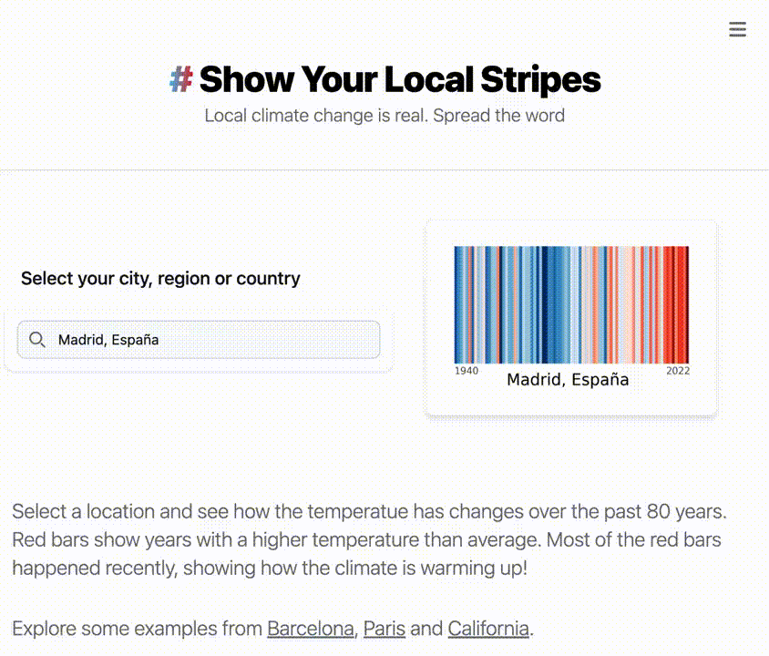

# [#ShowYourLocalStripes 🟦⬜🟨🟧🟥](http://showyourlocalstripes.com/) 

Front and backend of [https://showyourlocalstripes.com](https://showyourlocalstripes.com/).

- `backend/`: Python + FastAPI
- `frontend/`: Nuxt3 + TailwindCSS 
- The physical handling of clothes is done by [Teemill](https://showyourlocalstripes.teemill.com/product/api-XeMwzpqq8rfiRE3lQpm861O0/)
- The frontend is deployed to a static page in Digital Ocean, and the Backend to a Kubernetes cluster.
- Postgres database with [CloudNativePg](https://github.com/cloudnative-pg/cloudnative-pg) Kubernetes operator
- PostHog for analytics
